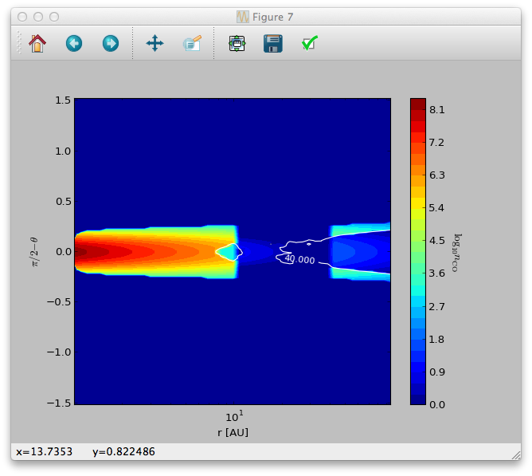
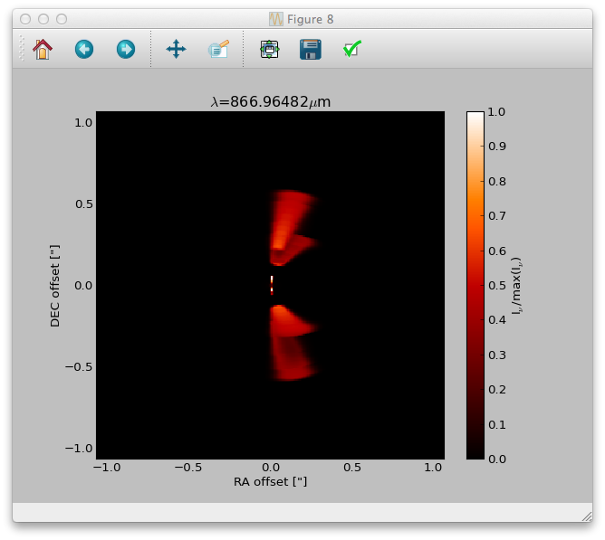

.. _tutorial-reggrid-line:

**********************************
Line model tutorial (regular grid)
**********************************

.. _tutorial-reggrid-line-model-setup:

Model setup
===========

Similarly to the dust setup we can use the :meth:`~radmc3dPy.setup.problemSetupGas` method to create all necessary input files for the line
simulations. In the following we will take the protoplanetary disk model as an example. It requires the dust model setup to be complete
and the dust temperature to be calculated (to set up a simple abundance model with photodissociation and freeze-out). To enhance the effect/visibility
of the freeze-out of the molecules close to the midplane rise the freeze-out temperature to 40K (Note, the real freeze-out temperature of 
CO molecules is around 19K and the 40K used here is only for illustration purpose)::
    
    >>> setup.problemSetupGas('ppdisk', gasspec_mol_freezeout_temp=[40.])

The :meth:`~radmc3dPy.setup.problemSetupGas` method takes one mandatory argument, the name of the model. 
Let us now see the gas structure in the disk. First we need to read the gas density::

    >>> data = analyze.readData(gdens=True, ispec='co')

The :meth:`~radmc3dPy.analyze.readData` method reads the content of the ``molecule_co.inp`` and puts it into the 
:attr:`radmc3dData.ndens_mol <radmc3dPy.analyze.radmc3dData>` attribute. When reading gas density with the :meth:`~radmc3dPy.analyze.readData` method
we always need to specify the name of the species with the ``ispec`` keyword (i.e. the part of the filename between ``molecule_`` and ``.inp``).
We can now make contour plots to display a vertical slice of the disk::

    >>> sc = plb.contourf(data.grid.x/natconst.au, np.pi/2.-data.grid.y, np.log10(data.ndens_mol[:,:,0,0].T).clip(1e-3), 30)
    >>> splb.xlabel('r [AU]')
    >>> splb.ylabel(r'$\pi/2-\theta$')
    >>> splb.xscale('log')
    >>> scb = plb.colorbar(c)
    >>> scb.set_label(r'$\log_{10}{n_{\rm CO}}$', rotation=270.)

We can also overplot the dust temperature to check whether freeze-out really happens at 40K as we specified::

    >>> data.readDustTemp()
    >>> sc = plb.contour(data.grid.x/natconst.au, np.pi/2.-data.grid.y, data.dusttemp[:,:,0,0].T, [40.],  colors='w', linestyles='solid')
    >>> splb.clabel(c, inline=1, fontsize=10)

The result should look like this:

.. _tutorial-reggrid-line-model-images:

Images
======

To calculate images/channel maps we need one additional data file with the molecular data (level energies, Einstein coefficients, etc.). 
Such files can be downloaded e.g. from the `Leiden Atomic and Molecular Database <http://home.strw.leidenuniv.nl/~moldata/>`_. 
Note, that the files downloaded from the Leiden database need to be renamed to ``molecule_MOLECULENAME.inp`` (e.g. `co.dat` -> `molecule_co.inp`). 
For our example we can also use the ``molecule_co.inp`` (12C16O data file downloaded from the Leiden database) in the ``python_examples/datafiles`` 
directory and copy it to the model directory. Then we are ready to make line channel maps::

    >>> image.makeImage(npix=300., incl=50., phi=0., sizeau=300., vkms=0.5, iline=3)

This command will calculate an image with 300 pixel and 300 AU each side, at an inclination of 50 degree. The image will be calculated for the
third line/transition int the molecular data file at a frequency/wavelength corresponding to 0.5 km/s assuming zero systemic velocity for the source. 
To calculate a full 3D image qube with multiple frequencies/velocities at once, instead of the ``vkms`` keyword one can use the ``widthkms`` and ``linenlam``
keywords. The ``widthkms`` keyword will set the total width of the image qube in velocity (in the unit of km/s) while the ``linenlam`` keyword will 
set at how many linearly spaced velocity bins should images be calculated for that interval. For the details of how to calculate line channel maps
see the `RADMC-3D manual <http://www.ita.uni-heidelberg.de/~dullemond/software/radmc-3d/>`_. 

Now we can read the calculate image (channel map)::

    >>> im = image.readImage()
     

And display it ::

    >>> image.plotImage(im, arcsec=True, dpc=140., cmap=plb.cm.gist_heat) 

